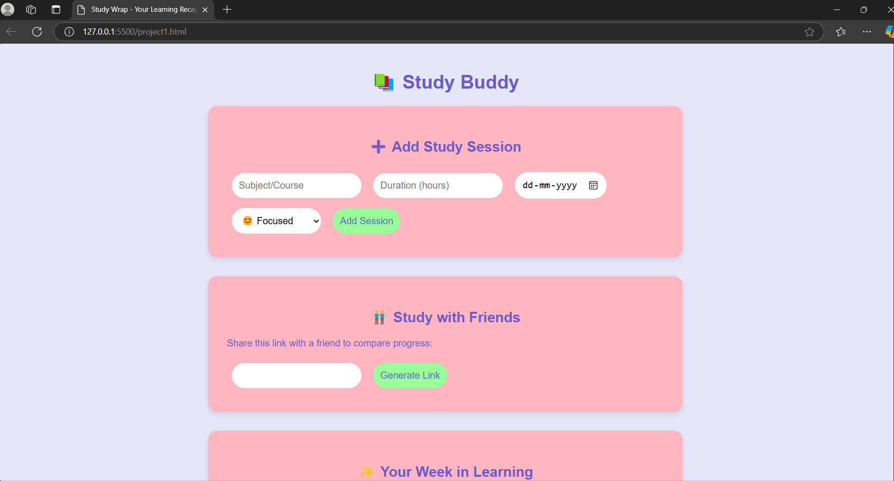
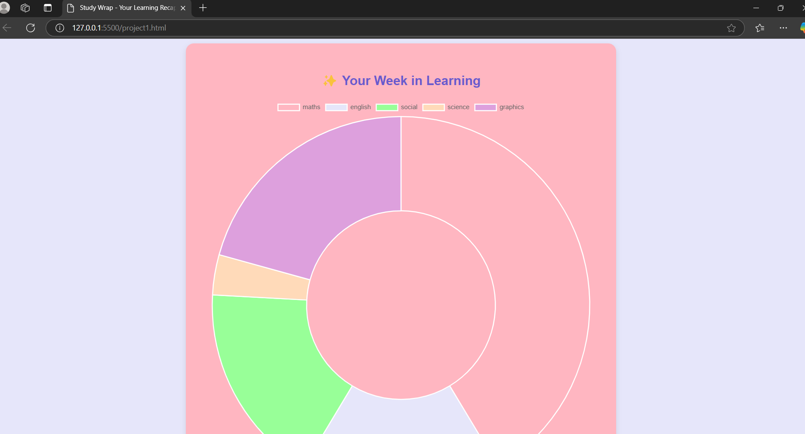

# [Project Name] 🎯

## Basic Details
### Team Name: [HUSTLERS]

### Team Members
- Member 1: [Megha Sebastian] - [Amal Jyothi College of Engineering]

### Hosted Project Link
[https://delightful-empanada-c26e34.netlify.app/project1.html]

### Project Description
[StudyBuddy is a study tracking web app that lets users log sessions, visualize progress with charts, and compare study time with friends. It includes mood tracking, a leaderboard, and a weekly recap to enhance learning productivity.]

### The Problem statement
[Helping students realize they spent more time generating fancy study reports than actually studying]

### The Solution
[By turning study tracking into a game—because nothing says "I’m productive" like a leaderboard, colorful charts, and a friendly competition to see who procrastinates the least]

## Technical Details
### Technologies/Components Used
For Software:
- [HTML (for structure)]

### Implementation
For Software:VSCODE
# Installation
[commands]

# Run
[commands]

### Project Documentation
For Software:

# Screenshots (Add at least 3)

*Add caption explaining what this shows*

*Add caption explaining what this shows*

*Add caption explaining what this shows*

# Diagrams

*Add caption explaining your workflow*

For Hardware:

# Schematic & Circuit

*Add caption explaining connections*

*Add caption explaining the schematic*

# Build Photos

*List out all components shown*

*Explain the build steps*

*Explain the final build*

### Project Demo
# Video
[https://drive.google.com/drive/folders/1O4lJ2mDZ1wPqG_7b_esJ45JRv2Ldf1xy?usp=sharing]
[This code creates a Study Tracking Web App where users can log their study sessions, track progress, and compare with friends. It features a form where users enter the subject, duration, date, and mood for each session, storing the data in localStorage. A report section visualizes study patterns using Chart.js, displaying a doughnut chart for study subjects and a line chart for daily study hours. Users can also generate a study buddy link to share with friends, although it currently doesn’t sync data between users. The app provides a leaderboard, tracking total study hours, and enhances user experience with a clean, responsive UI.]
*Explain what the video demonstrates*

# Additional Demos
[Add any extra demo materials/links]

## Team Contributions
- [Megha Sebastian]: [100%]
]

---
Made with ❤️ at TinkerHub
